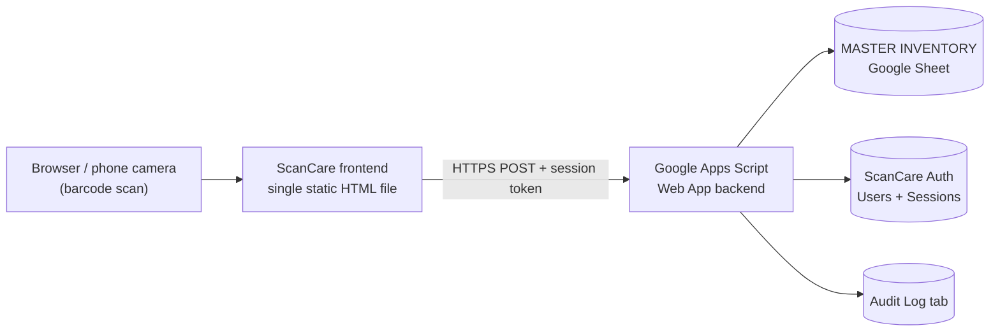

# ScanCare

A live barcode inventory app built to replace manual stock counting on the warehouse floor — scan a barcode, see everything about it, add or adjust stock right there, with real accounts and a full audit trail behind it.

## Why I built this

I run inventory for a retail skincare business, and before this, stock counts lived on paper and in scattered spreadsheet edits — no record of who changed what, no way to tell at a glance what was expiring soon or running low, and no real login, just a shared password everyone typed in. I built ScanCare to fix that: a phone-first tool that scans a barcode, decodes it right in the browser, and shows live stock straight from our Google Sheet — with real per-user accounts, role-based permissions, and a backend audit log of every change.

It's been in daily use since it shipped, and every feature in here came from an actual problem that came up while running it — not a spec written up front.

## What it does

- **Scan any barcode** with the phone camera (decoded client-side, works on iPhone and Android) or type it in manually — one screen shows everything on file for it, no separate "modes" to pick between first.
- **Edit inline, per batch.** A product can have several expiry batches on the shelf at once; each one gets its own Edit link to adjust its quantity or notes directly, without retyping its expiry to find it again. Adding a genuinely new expiry lot is a clearly separate action, so the two never get confused.
- **Rename a product** — brand and name — right from its details screen, updating every batch that shares its barcode in one shot.
- **Browse and search live inventory**, sorted by nearest expiry, with color-coded warnings for low stock and items expiring soon.
- **Real accounts, not a shared password.** Backend-verified login (PBKDF2-hashed passwords, per-user random salt, opaque session tokens, brute-force lockout) with two roles: warehouse/admin accounts can add and edit stock, read-only accounts can look everything up but never change it — enforced on the backend, not just hidden in the UI.
- **A full audit log**, written server-side on every add, adjust, and rename — who did what, when, to which row — regardless of what the client claims about itself.
- **Dark and light mode**, overridable per device, remembered locally.
- **Live-synced to Google Sheets** — the sheet a warehouse team already knows how to use is the actual database; no separate admin panel to maintain.

## Screenshots

| Scan and edit a batch inline | Rename a product | Browse and search inventory |
|---|---|---|
|  |  |  |

| Add a new expiry lot | Read-only account view | Light / dark mode |
|---|---|---|
|  |  |  |

*(All screenshots use fictitious sample data — no real business inventory is shown.)*

## Tech stack

- **Frontend:** a single self-contained HTML file — vanilla JavaScript, no framework or build step, so it can be hosted anywhere static files are served (this deployment runs on GitHub Pages). Barcode decoding runs entirely client-side via [ZXing](https://github.com/zxing-js/library).
- **Backend:** [Google Apps Script](https://developers.google.com/apps-script), deployed as a Web App. All business logic, authentication, and authorization live here — the frontend is never trusted with anything sensitive.
- **Database:** Google Sheets — one spreadsheet holds live inventory plus a backend-written audit log; a separate spreadsheet holds user accounts and active sessions.
- **Auth:** PBKDF2-HMAC-SHA256 password hashing (hand-built from Apps Script's native `Utilities.computeHmacSha256Signature`, since there's no external crypto library available), a random per-user salt, opaque bearer session tokens, and role checks enforced on every write.

## Architecture

The frontend never talks to the spreadsheets directly and never sees a password or a raw sheet ID that matters for security — every operation is a POST to the Apps Script backend, which validates the session token, checks the account's role, and is the only thing that ever reads or writes the sheets.

## Security notes

A few of the deliberate choices worth calling out, since this is the part I spent the most time getting right:

- Passwords are never stored — only a salted PBKDF2 hash is. The plaintext exists only momentarily in the Apps Script editor when generating a new account.
- Every write op (`append`, `adjust`, `rename`) re-checks the caller's role **on the server**, not just in the UI — hiding a button is a convenience for honest users, not the actual security boundary.
- Adjusting a quantity is done as a signed delta against a freshly-read current value inside a script-wide lock, not as an absolute overwrite — so two people adjusting the same batch from different devices at the same moment can't silently clobber each other.
- A generic "invalid username or password" response covers every failure case (unknown user, disabled account, locked out, wrong password) — an attacker probing usernames learns nothing from the error message.
- Per-username lockout after repeated failed attempts, with a cooldown period.

## Self-hosting this

1. Make a copy of a MASTER INVENTORY spreadsheet with the columns: `Barcode, Brand, Product, Expiry (MM-YYYY), Expiry Date (unused), tag, collection tag, discount, Quantity, Notes`, and add an `Audit Log` tab (the script creates rows in it automatically once it exists).
2. Make a separate ScanCare Auth spreadsheet with two tabs: `Users` (`Username, PasswordHash, Salt, Role, Active, FailedAttempts, LockedUntil`) and `Sessions` (`Token, Username, Role, CreatedAt, ExpiresAt`).
3. Copy [`Code.gs`](Code.gs) into a new Apps Script project bound to your MASTER INVENTORY sheet, and fill in both spreadsheet IDs at the top of the file (see the comment there for exactly where to find an ID in a sheet's URL).
4. Run `generateUserCredentials_()` once from the Apps Script editor to create your first admin account, and copy its logged output into a new row in the Users tab.
5. Deploy the script as a Web App (Execute as: Me, Who has access: Anyone) and copy the deployment URL into `API_URL` near the top of `index.html`.
6. Host `index.html` anywhere that serves static files — GitHub Pages, or any web server.

## About this project

Built and maintained by me, a warehouse supervisor who wanted a better way to run daily stock counts and taught myself to build it — full-stack, from barcode scanning and offline-capable UI through to backend authentication and a security model I'd trust with real accounts. It's live and in daily use.
